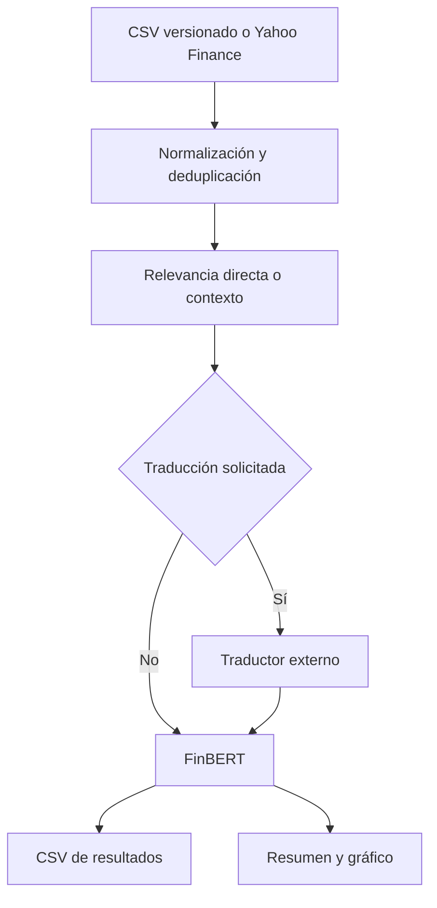

# Análisis de sentimiento financiero con FinBERT

Pipeline educativo para extraer titulares asociados a un activo, normalizar la respuesta de Yahoo Finance y clasificarlos como positivos, negativos o neutrales mediante [`ProsusAI/finbert`](https://huggingface.co/ProsusAI/finbert).

El proyecto separa dos objetivos:

1. **Reproducibilidad:** una muestra sintética versionada permite repetir la inferencia sin depender de Internet.
2. **Exploración actual:** el mismo pipeline puede consultar las noticias que Yahoo asocia a un ticker en el momento de la ejecución.

> Las etiquetas describen la salida del modelo sobre el texto. No son una predicción del precio, una recomendación de inversión ni una validación de la veracidad de la noticia.

## Problema

Las fuentes financieras publican titulares con estructuras y grados de relación diferentes. Una noticia devuelta para `TSLA` puede mencionar directamente a Tesla o limitarse a describir el contexto tecnológico o macroeconómico.

El pipeline:

- admite tanto el formato plano como el formato anidado de `yfinance.Ticker.news`;
- elimina titulares vacíos y duplicados;
- conserva fecha, fuente, resumen y enlace;
- diferencia menciones directas de noticias de contexto mediante términos configurables;
- ejecuta FinBERT una sola vez sobre el conjunto de titulares;
- guarda la etiqueta y el score del modelo en campos separados;
- genera un CSV y una visualización reproducibles.

## Arquitectura



La traducción es opcional y está desactivada por defecto. Utiliza un servicio externo y puede alterar matices financieros, por lo que no garantiza que la clasificación sea correcta.

## Datos de demostración

`data/sample_headlines.csv` contiene titulares sintéticos creados exclusivamente para reproducir el flujo técnico. No son noticias reales ni forman un conjunto de validación etiquetado.

Columnas principales:

| Campo | Descripción |
|---|---|
| `ticker` | Activo asociado al titular |
| `published_at` | Fecha de publicación disponible |
| `title` | Texto enviado al modelo |
| `relevance` | `direct` si menciona el activo; `context` en caso contrario |
| `model_label` | Clase generada: positive, negative o neutral |
| `model_score` | Score softmax de la clase elegida; no es certeza calibrada |

## Instalación

Desarrollado para Python 3.12.

```bash
git clone https://github.com/jorgegalanr/nlp-financial-sentiment.git
cd nlp-financial-sentiment
python -m venv .venv
```

Activación en Windows PowerShell:

```powershell
.\.venv\Scripts\Activate.ps1
```

Activación en Linux o macOS:

```bash
source .venv/bin/activate
```

Instalación:

```bash
python -m pip install --upgrade pip
python -m pip install -r requirements.txt
```

La primera inferencia descarga los pesos de FinBERT desde Hugging Face.

## Ejecución

### Muestra local reproducible

```bash
python run_analysis.py --input data/sample_headlines.csv
```

### Noticias actuales asociadas a Tesla

```bash
python run_analysis.py --ticker TSLA --company-term Tesla
```

### Traducción explícita al inglés

```bash
python run_analysis.py --input data/sample_headlines.csv --translate
```

Los resultados se guardan por defecto en:

```text
reports/sentiment_results.csv
reports/sentiment_distribution.png
```

## Notebooks

- `01_exploracion_original.ipynb`: conserva el proceso de descubrimiento inicial, incluidos los cambios de estructura observados en Yahoo.
- `02_pipeline_reproducible.ipynb`: utiliza los módulos reutilizables y la muestra versionada.

El primer notebook es histórico. Sus diez noticias y sus salidas pertenecen a una ejecución concreta y no constituyen una validación del modelo.

## Pruebas

Las pruebas no descargan FinBERT ni consultan Yahoo. Utilizan respuestas simuladas para verificar la lógica propia del proyecto.

```bash
python -m pip install -r requirements-test.txt
python -m pytest -q
```

Se comprueba:

- compatibilidad con respuestas planas y anidadas de Yahoo;
- extracción de fecha, fuente y enlace;
- clasificación de relevancia;
- eliminación de duplicados y registros sin titular;
- correspondencia entre titulares y predicciones;
- traducción únicamente cuando se solicita.

## Qué demuestra el proyecto

- Integración de un Transformer financiero preentrenado.
- Normalización defensiva de datos externos con estructuras cambiantes.
- Separación entre extracción, inferencia y presentación.
- Uso de dependencias inyectables para probar el código sin red ni modelos pesados.
- Comunicación explícita de las limitaciones de un score de sentimiento.

## Limitaciones

- No se compara la salida con etiquetas humanas, por lo que no se estima accuracy, precision, recall o F1.
- FinBERT fue ajustado principalmente para texto financiero en inglés.
- La traducción puede modificar términos o matices relevantes.
- Yahoo puede cambiar su estructura, disponibilidad o selección de noticias.
- Una noticia relacionada con un ticker no necesariamente habla directamente de la empresa.
- El score del modelo no está presentado como probabilidad calibrada de que la etiqueta sea correcta.
- No se estudia la relación entre sentimiento y rentabilidad posterior.

## Estructura

```text
.
├── data/
│   └── sample_headlines.csv
├── notebooks/
│   ├── 01_exploracion_original.ipynb
│   └── 02_pipeline_reproducible.ipynb
├── reports/
├── src/
│   ├── news.py
│   └── sentiment.py
├── tests/
│   ├── test_news.py
│   └── test_sentiment.py
├── run_analysis.py
├── requirements.txt
└── requirements-test.txt
```

## Autor

Jorge Galán Rodríguez — [GitHub](https://github.com/jorgegalanr) · [LinkedIn](https://www.linkedin.com/in/jorgegalanrodriguez)

## Licencia

MIT
